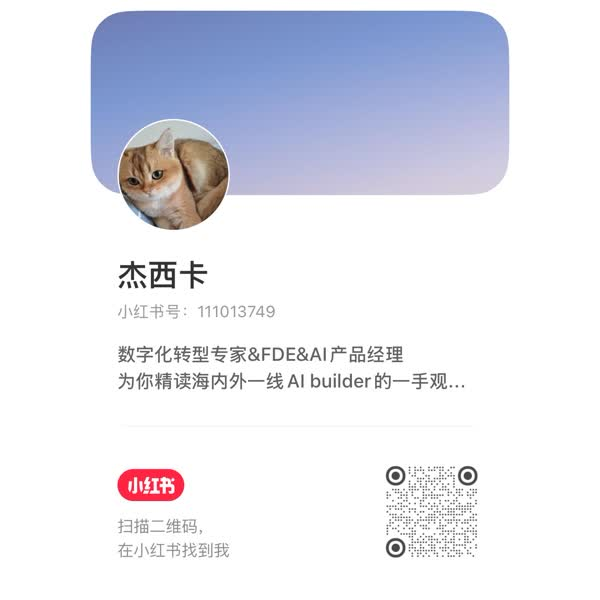

# 你好，我是杰西卡 👋

> I build AI products & agent skills, and share the whole process in public.

我是一个 **AI 产品人**，在 **build in public**——一边做产品，一边把过程和踩过的坑公开分享。

我做的东西都围绕一个信念：**AI 吃掉杂活，判断留给人**。我想把「**信息 → 认知 → 内容**」
这条链路做成一个人也能转起来的飞轮：把读到、看到的东西快速读懂、沉淀进自己的知识库，
再变成能发出去的内容。下面这些项目，都是这个飞轮上的一环。

📱 小红书 / 公众号「**杰西卡聊AI**」· 抖音 **@杰西卡** —— 我在这些地方分享 AI 产品、
AI 落地的一手经验和思考（主页二维码见文末，欢迎来聊）。

---

https://github.com/user-attachments/assets/2d873ad5-4439-4a17-9f24-9112ee7d2ce0

▶️ 3 分钟看我怎么<b>一个人用 AI 做内容</b> · a 3-min look at how I do content solo with AI（下面的 knowledge-workbench 就是这套流水线）

---

## 📝 写作 · Writing

边做边写，把方法和踩过的坑公开分享：

- 📖 [《你效率提升 10 倍，你们公司为什么没有？》](https://mp.weixin.qq.com/s/tq8vUI52kRXyn2ZvPDWwwg) · 公众号「**杰西卡聊AI**」

> 想追更多，扫文末公众号二维码「杰西卡聊AI」。

---

## 🧠 旗舰 · knowledge-workbench

🧠 [**knowledge-workbench**](https://github.com/heyuxuan0209/knowledge-workbench) —— 一个人把
「信息 → 认知 → 内容」做成飞轮的完整尝试：**采集 → 理解 → 沉淀 → 创作 → 发布 → 复盘**。
上面那条视频讲的就是它；下面两个 skill 也是从这里提炼出来的。

## 🌟 read & watch —— 让 AI 替你「读懂」和「看懂」

一对姊妹 skill，装进任何能跑 shell 的 AI agent（Claude Code / Codex / Cursor / Gemini CLI …）就能用，
丢链接就出中文解读，产物是你自己的 markdown：

📖 [**read-anything**](https://github.com/heyuxuan0209/read-anything) —— 任意链接（网页 / 博客 /
播客 / X）→ 中文结构化解读 → NotebookLM 式对话。**read 管读文字。**

🎬 [**watch-anything**](https://github.com/heyuxuan0209/watch-anything) —— X / YouTube / B站 视频
（**含无字幕**）→ 自动下音轨转写 → 中文卡片解读（摘要 / 要点 / 金句中英对照）。**watch 管看视频。**

## 🧰 Agent Skills & 工具

🛠️ [**open-skills**](https://github.com/heyuxuan0209/open-skills) —— 实战踩坑攒出来的
Claude Code / Agent Skills 合集（定期大扫除 deep-clean 等）。

🌉 [**codex-feishu-bridge**](https://github.com/heyuxuan0209/codex-feishu-bridge) —— 把 Codex CLI
桥接成飞书 / Lark 机器人：扫码建 bot、macOS 后台常驻、空闲不烧 token。

🤝 [**mindforge**](https://github.com/heyuxuan0209/mindforge) —— 多 AI 协作的终端工具，
自动管理上下文与决策。

## 🛒 产品作品集

🛒 [**mall-operation-system**](https://github.com/heyuxuan0209/mall-operation-system) —— AI 驱动的
商户运营管理系统（把资深商场专家的经营判断变成可复用的 Agent 工作流）。

📈 [**KOL-match**](https://github.com/heyuxuan0209/KOL-match) —— 电商达人投放决策系统。

---

## 🔗 关注我 · learn in public, build in public

想一起 learn / build in public，或认识做内容、做 AI 产品的朋友，欢迎关注、来聊：

<table>
  <tr>
    <td align="center"><b>小红书</b></td>
    <td align="center"><b>微信公众号</b></td>
    <td align="center"><b>抖音 / 视频号</b></td>
  </tr>
  <tr>
    <td align="center"></td>
    <td align="center"></td>
    <td align="center"></td>
  </tr>
  <tr>
    <td align="center">杰西卡 · 小红书号 <code>111013749</code></td>
    <td align="center">搜「<b>杰西卡聊AI</b>」关注</td>
    <td align="center">@杰西卡 · 抖音号 <code>2179932674</code></td>
  </tr>
</table>
